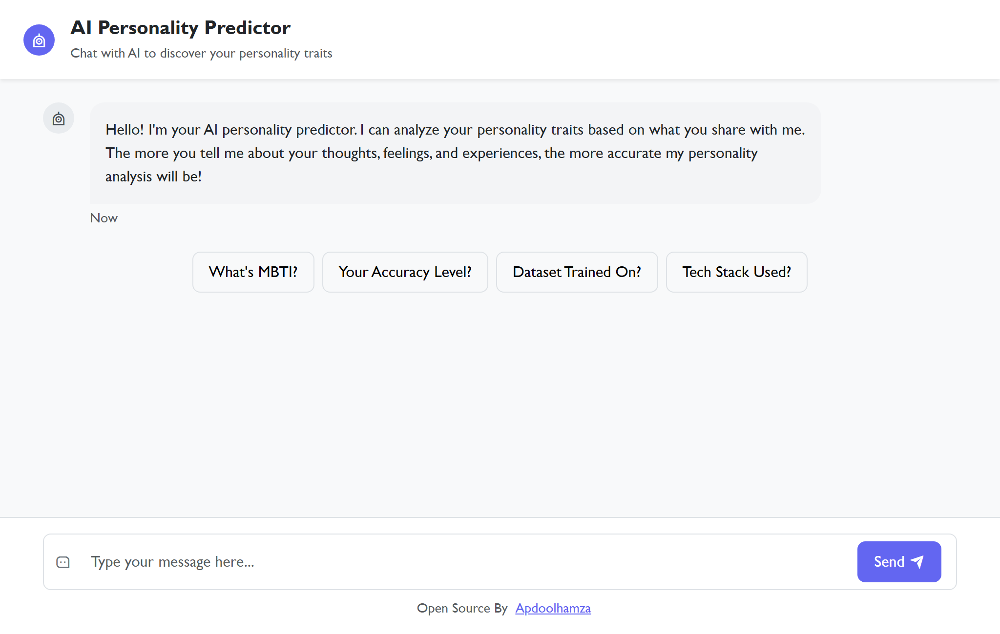

# Personality Predictor AI (ML + Flask)

A simple yet powerful smart **AI Personality Predictor** that guesses your MBTI type just by analyzing your writing.



## Live Demo
👉 [Visit the App!](https://personality-predictor-gfjj.onrender.com/)

## What does it do?

It predicts your **MBTI Personality Type** (like INTJ, ENFP, ISTP, etc.) based on what you write.
It also shows an easy-to-understand explanation of:
- Your type
- What it means
- A famous quote ...

## Dataset
This AI was trained on a public dataset made from over 8,000+ people’s writings, where each person’s MBTI type is known.
The writings were collected from [Kaggle](https://www.kaggle.com/datasets/datasnaek/mbti-type) a popular dataset repository, so the model learned how people with different personality types express themselves through text.

## 🛠 Technologies Used
* Python
* Scikit-learn
* Flask
* Bootstrap 5
* HTML5
* CSS

## ⚙️ How to Run Locally

```bash
git clone https://github.com/apdoolhamza/personality-predictor.git
cd personality-predictor
```
### Install dependencies
```bash
pip install -r requirements.txt
```
### Run it
```bash
python app.py
```
## Author
Built with ❤️ by [@apdoolhamza](https://github.com/apdoolhamza/)

##  License
This project is open source under the [MIT License](https://github.com/apdoolhamza/customer-feedback-sentiment-checker/blob/main/LICENSE)
